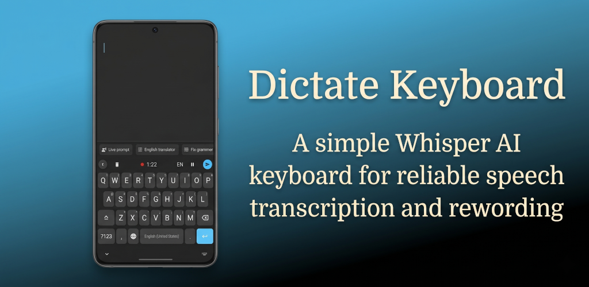
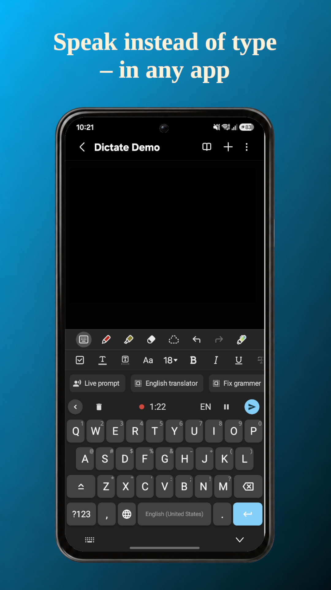
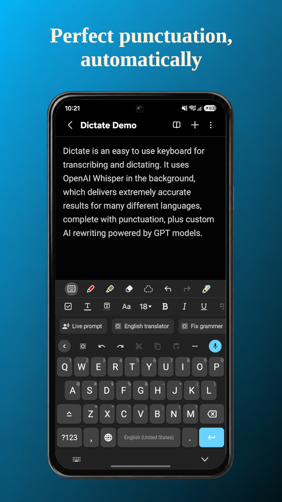
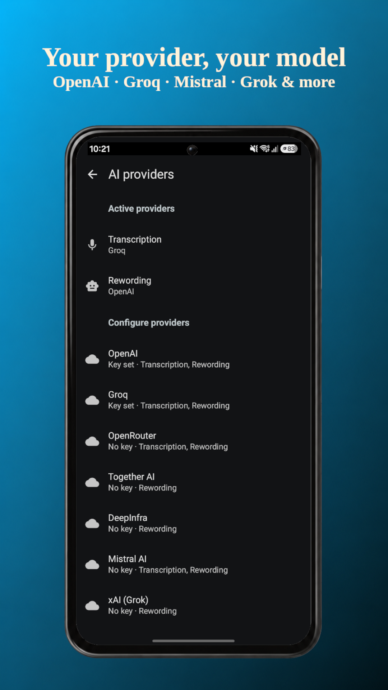
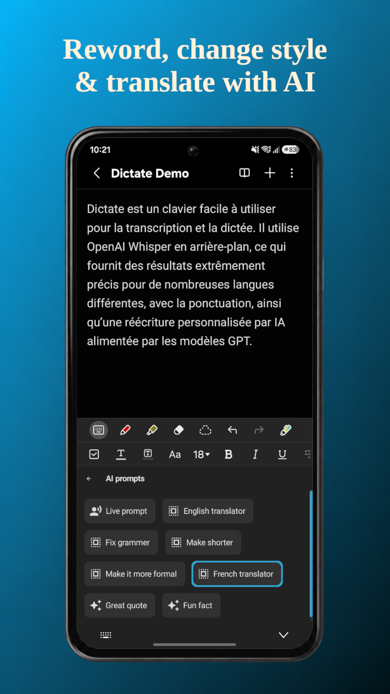
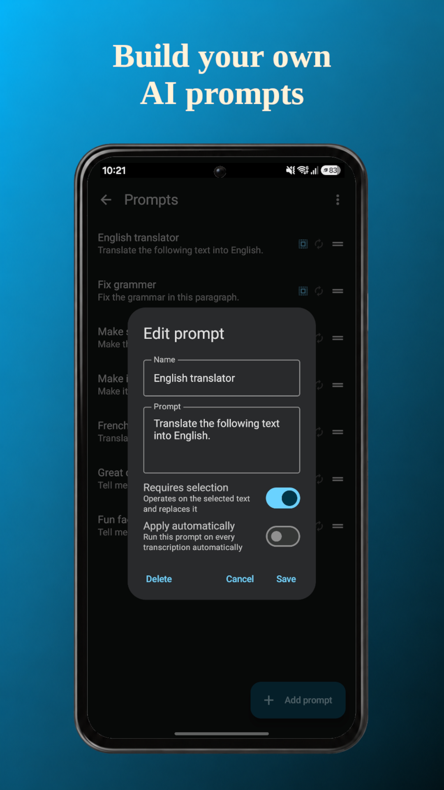
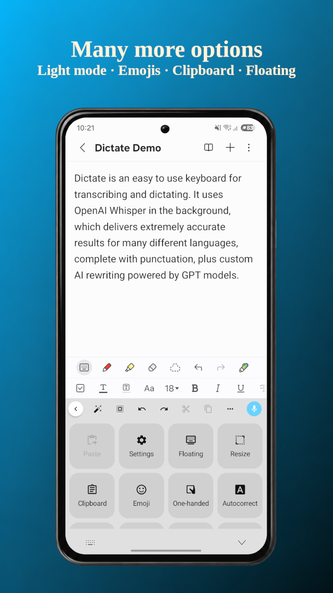

<table>
  <tr>
    <td>
      
    </td>
    <td>
      <h1>Dictate Keyboard</h1>
      <i>A powerful Whisper AI keyboard for reliable speech transcription</i>
    </td>
  </tr>
</table>

<table>
  <tr>
    <td align="center">
      
    </td>
    <td align="center">
      
    </td>
  </tr>
</table>

---

> **Note:** This is a complete rebuild of Dictate as a full, standalone keyboard on top of
> [**FlorisBoard**](https://github.com/florisboard/florisboard), replacing the original Java
> app that powered Dictate v1–v3. The previous Java codebase is preserved on the
> [`legacy-java`](https://github.com/DevEmperor/Dictate/tree/legacy-java) branch.

---

## 📸 Screenshots

<table>
  <tr>
    <td></td>
    <td></td>
    <td></td>
  </tr>
  <tr>
    <td></td>
    <td></td>
    <td></td>
  </tr>
</table>

## 📲 Installation

**The app is available on [Google Play](https://play.google.com/store/apps/details?id=net.devemperor.dictate)**
(for a small fee that supports continued development), giving you easy installation and free
lifetime updates. Just tap the badge above or [this link](https://play.google.com/store/apps/details?id=net.devemperor.dictate).

> **Existing users:** the new keyboard keeps the same app identity and signing key, so your
> settings carry over on update — no reinstall, no lost configuration.

## ✨ What is Dictate?

**Dictate** is an easy-to-use keyboard for transcribing and dictating. It uses
[OpenAI Whisper](https://openai.com/index/whisper/) in the background, which delivers
extremely accurate results for
[many different languages](https://platform.openai.com/docs/guides/speech-to-text/supported-languages),
complete with punctuation — plus custom AI rewording powered by leading models from OpenAI,
Google Gemini and many other providers.

Instead of pecking at keys, just tap the microphone, speak, and watch your words appear as
clean, formatted text in any app. Need it more formal, translated, summarised, or
fixed-up? Hand the text to a rewording prompt and let the model do the work. With the new
floating button you can even dictate straight into apps while another keyboard is open.

## 🎤 Features

- **Voice dictation with Whisper AI** — highly accurate speech-to-text in dozens of languages, with automatic punctuation. It's so sensitive you can literally *whisper* and still get a clean transcription.
- **Floating dictation button** — dictate straight into **any** app, even when another keyboard is active. Pick from three styles (Pill, Ring, Orb), watch a live waveform while you speak, drag it anywhere with edge-snapping, set its color and size, and long-press to reword.
- **AI rewording & rewriting** — turn a selection into something more formal, casual, translated, summarised, or anything you define with custom prompts.
- **Custom prompts & snippets** — build your own reword actions; reusable text snippets are inserted instantly without an API call.
- **Bring your own key & provider** — use your own API key with OpenAI, Google Gemini, Groq, Mistral, OpenRouter, Soniox and other compatible endpoints, so you stay in control of usage and cost.
- **A real, full keyboard** *(courtesy of the FlorisBoard base):*
  - Huge variety of keyboard layouts and easy language/subtype switching
  - Full theme customization with day/night presets and automatic switching
  - Emoji keyboard, clipboard manager & cursor tools
  - One-handed / compact mode, gesture actions, customizable key sound & vibration
- **Privacy-respecting by design** — no tracking; your audio goes only to the AI provider you configure.

## 🧱 Built on FlorisBoard

Dictate Keyboard is a fork of [**FlorisBoard**](https://github.com/florisboard/florisboard),
an open-source, privacy-respecting keyboard created by
[Patrick Goldinger](https://github.com/patrickgold) and
[The FlorisBoard Contributors](https://github.com/florisboard/florisboard/graphs/contributors).
Their work provides the entire keyboard foundation — layouts, theming, gesture handling,
clipboard tools and the IME plumbing — on top of which Dictate adds its voice-dictation and
AI-rewording layer.

Huge thanks to the FlorisBoard team. FlorisBoard is licensed under the Apache License 2.0;
see [`LICENSE`](LICENSE) and [`NOTICE`](NOTICE) for full attribution.

## 🤝 Contributing

The best way to help right now is to **[open an issue](https://github.com/DevEmperor/Dictate/issues)**
with bug reports, ideas or feedback. Full contribution and community guidelines will be
published as the project matures. Thank you! 🙏

## 📄 License & attribution

Dictate Keyboard is released under the terms of the
[Apache License 2.0](https://www.apache.org/licenses/LICENSE-2.0).

- This project is a fork of **FlorisBoard** — Copyright © The FlorisBoard Contributors,
  licensed under Apache-2.0.
- See [`LICENSE`](LICENSE) for the full license text and [`NOTICE`](NOTICE) for required
  attribution notices.
- Speech recognition is powered by [OpenAI Whisper](https://openai.com/index/whisper/).

## ❤️ Support

If Dictate makes your day a little easier, you can support development by
[buying the app on Google Play](https://play.google.com/store/apps/details?id=net.devemperor.dictate)
or [donating via PayPal](https://paypal.me/DevEmperor). Every bit helps — thank you!
